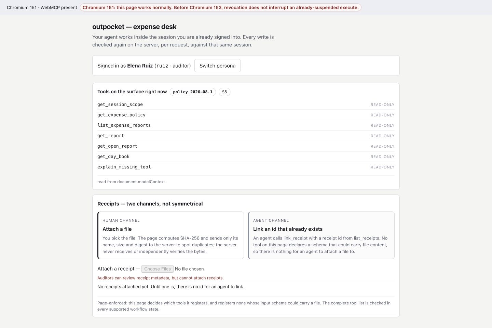
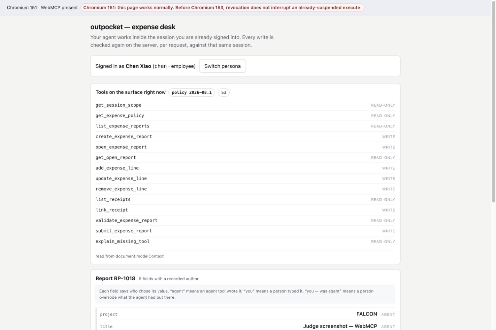
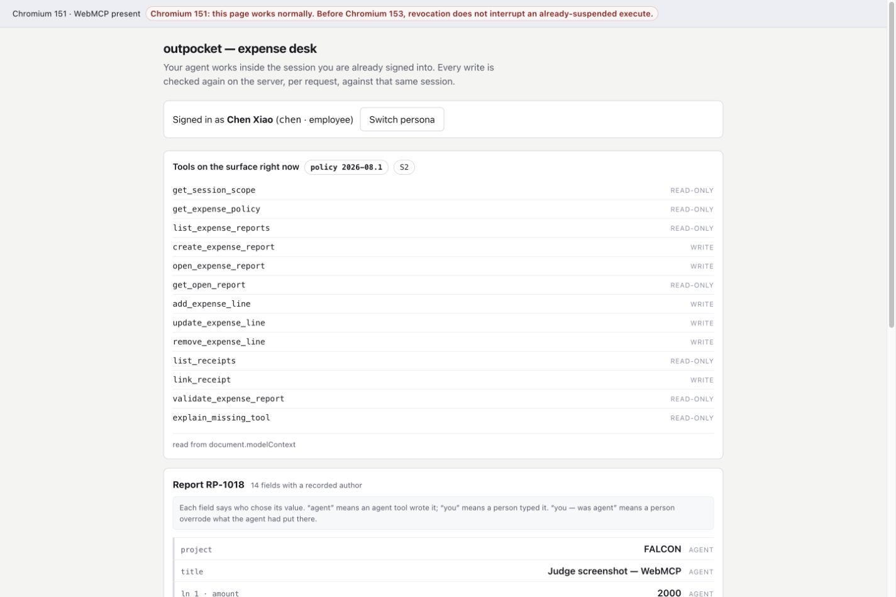

# outpocket

**A WebMCP expense desk where an agent prepares and corrects a reimbursement
inside the employee's already-authenticated page session, while the employee
keeps control of sign-in, receipt attachment, review, and signature.**

[Live app](https://outpocket.onrender.com/) ·
[Seeded moving demo](https://outpocket.onrender.com/?demo=1&seed=7) ·
[Five-minute judge guide](docs/JUDGE-GUIDE.md) ·
[Devpost draft](docs/DEVPOST.md) ·
[MIT license](LICENSE)

> **Fastest judge path:** open
> **[the seed-7 demo](https://outpocket.onrender.com/?demo=1&seed=7)**. The page
> labels the run, signs in through its own chen persona control, and drives a
> repeatable filing from the 6-tool employee home surface to a 14-tool clean
> draft. It stops before submission because the signature remains a human act.

The catalogue contains **17 distinct tools across 6 registration states**. The
page adds and revokes tools as the session, open report, and validation verdict
change; the revised list reaches the agent on its next turn. The set of write
tools is computed in every state from each tool's `readOnlyHint`, never from a
separate hard-coded list.

**Demo personas:** `chen` is the employee and `ruiz` is auditor Elena Ruiz; both
are one click with no password. **Known open limit:** the signature flow can
bind a response to the authenticated session and presented snapshot, but it
cannot prove a person clicked—the full disclosure is below.

## Copy this prompt

Sign in as chen, connect an agent to the page, and paste:

```text
Work only through the tools registered by this page. Read my signed-in scope and the current expense policy. Create a report titled "Judge smoke test" under the first active project in my scope. Add one line dated today for City Cab Co., category transport, USD 20.00, and set the description (business purpose) to "Airport transfer". Follow any returned fix hints until there are no blocking findings, then validate the report. Stop when submit_expense_report becomes available, tell me the report id, and do not submit it.
```

That walk starts at S1, creates an open draft at S2, and ends at S3 with
`submit_expense_report` present. The page's surface inspector makes the 6 → 13
→ 14 transition visible while the agent works.

## Who this is for, and why WebMCP

Outpocket is for employees who have paid a company expense themselves and for
the finance teams that must review the resulting claim. Today the employee
usually retypes receipt data into a form, or the company builds a second API,
RPA, or integration-layer path. A custom connector—or a platform such as Truto,
Merge, Paragon, or Nango—can automate the workflow, but it commonly introduces
a credential path separate from the employee's current login.

WebMCP changes where the work happens. After the employee signs in, the agent
uses tools registered by that page and same-origin requests carry the existing
session. No intermediary needs a separate long-lived API token. The employee
and agent can now work on the same live report: the agent handles transcription,
policy lookup, and repair loops; the employee attaches the receipt files,
reviews the exact snapshot, and decides whether to sign.

It also takes a position on who should run the model. An ERP that wants an
assistant today usually ships one: it hosts or buys inference, maintains
prompts and skills, pins a model, and chases that model's drift — and its users
get whichever copilot the vendor chose. This site ships no model and runs no
agent: `package.json` has an empty dependency list, and there is no inference
call or API key anywhere in the repository. The page publishes a typed tool
surface, the employee brings their own WebMCP-capable client (today, the
ChatGPT desktop browser, or Chrome 149+ behind a flag), and when that client's
model improves the workflow improves with nothing redeployed here. Model choice
and model churn move out of every site and into the one client the user picked;
the site's contract with the agent is the tool schema and the server's
per-request checks, not a prompt tuned to one vendor's model.

The same reasoning bounds what we would expose as a backend MCP server for a
flow like this one. A backend server needs its own standing credential to the
ERP and does its work wherever the agent runs, away from the page the employee
is looking at. For a claim a person signs and remains responsible for, we
wanted the opposite defaults: authorization that starts at the employee's own
login, work that happens on the page the employee can see, and the
responsibility-bearing acts — receipt, review, signature — never leaving the
human. That is a fit statement, not a security ranking: the server here still
treats every caller as untrusted, and the forgery vector this design does have
is documented below and in `RISK.md`.

Expense reimbursement is personal: the employee is out of pocket and remains
responsible for the claim. That is why this project does not aim for unattended
submission.

## Open the app

### ChatGPT's built-in browser

Open the [live app](https://outpocket.onrender.com/) directly. The ChatGPT
desktop built-in browser needs no Chrome flag.

### Chrome 149+

Use the launch line for your platform, then open the live app:

```text
Linux:   google-chrome --enable-features=WebMCP
macOS:   open -a "Google Chrome" --args --enable-features=WebMCP
Windows: chrome.exe --enable-features=WebMCP
```

Alternatively, visit `chrome://flags/#enable-webmcp-testing`, choose
**Enabled**, and restart Chrome.

In DevTools, this feature check must return `true`:

```js
'modelContext' in document
```

The supported entry point is `document.modelContext`.

## Demo personas

Both are one-click personas with no password. Their server-issued session
cookie determines the role used for every request.

| Name | Role | Login | What to inspect |
| --- | --- | --- | --- |
| Chen Xiao | employee | `login: chen` | Create, correct, validate, review, and submit a report |
| Elena Ruiz | auditor | `login: ruiz` | Read submitted reports and the day book; no write tools |



## The surface is the workflow menu



| Registration state | Tool count | Visible change |
| --- | ---: | --- |
| Signed out | 2 | Sign-in status and an explanation for absent tools |
| Employee, no report open | 6 | Report discovery and creation become available |
| Employee, draft has blocking findings | 13 | Editing, receipt linking, and validation are available |
| Employee, clean draft | 14 | `submit_expense_report` joins the next agent turn |
| Employee, submitted report | 7 | Editing and submission leave the menu |
| Auditor | 7 | Every registered tool is read-only |

The changing menu guides the agent, but it is not the authorization check.
Every write is authorized again by the server against the current session, and
the commit route independently recomputes the verdict. A report with blocking
findings is refused with HTTP 422 `E_NOT_CLEAN` even if a caller bypasses the
page.



## What the signature adds—and what it does not

The client already applies its own website-access and confirmation policies.
Outpocket adds a narrower mechanism: the sign request carries a canonical digest
of the exact report and policy snapshot shown for review, and the server
re-canonicalizes current state before commit. An edit after review therefore
does not match the signed snapshot.

This is **not proof that a person clicked**. A caller that holds the authenticated
session and can read the token placed in the rendered dialog can skip the human
review and issue `POST /api/sign/{id}/respond` itself. We have not measured that
DOM-read ability for the evaluated client, but the vector remains open for any
caller that has it. The token raises the cost; it does not establish personhood.
Because signer identity comes from the real session and time comes from the
server, the day book can accurately attribute an account and timestamp to an
event that did not happen—and that record is indistinguishable there from a
genuine click.

Tool definitions and tool results are also treated as untrusted content by the
client. No permission depends on persuasive tool text: session authorization,
validation, request state, and digest comparison all run below the registered
description.

## Other current limits

- The deployment is one Node.js process with in-memory sessions, reports, sign
  requests, and day-book state. A page reload survives; a process restart does
  not. There is no multi-instance coordination or durable database yet.
- The demo personas are shared, not a multi-tenant account model. Multiple
  visitors using one persona in the same running process see and can edit one
  another's drafts. A deployment restart clears those drafts with the rest of
  the in-memory state.
- Receipt bytes stay in the browser. The server receives receipt metadata and a
  SHA-256 value computed in the browser; it does not receive or independently
  validate the attachment bytes. The chain therefore covers the recorded
  metadata and digest, not proof that the server saw the file.
- Challenge judges may evaluate the submission materials without running the
  project. The [judge guide](docs/JUDGE-GUIDE.md) therefore maps each visible
  claim to source, tests, evaluations, and captured evidence.

## Repository layout

| Path | Contents |
| --- | --- |
| `src/` | Expense policy, canonicalization, page UI, tool definitions, and state compiler |
| `server/` | Session authorization, report routes, signature state, server-side re-canonicalization, and day-book chain |
| `tests/` | Unit and acceptance tests, including real-HTTP role checks |
| `evals/` | Expected surfaces, negative cases, blind review, and mutation results |
| `evidence/` | Captured browser, deployment, and rehearsal observations |
| `erp/contracts/` | Frozen schemas and interface contracts used by the implementation and evaluations |
| `docs/` | Judge walkthrough and submission copy |

## License

MIT — see [LICENSE](LICENSE).
